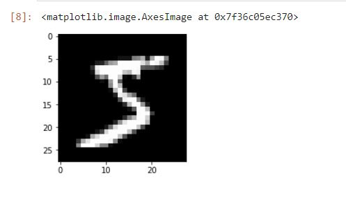
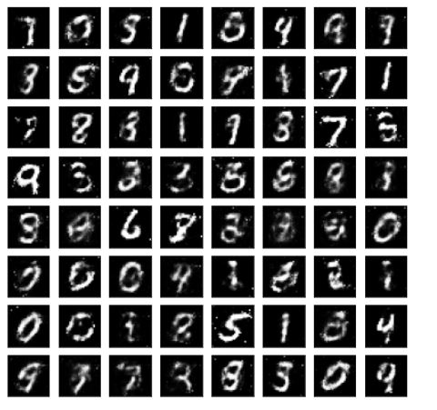
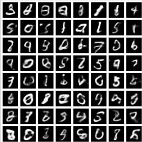

# GAN_VS_VAE
A practical check on GAN vs VAriational Autoencoders for image generation

One can install the dependencies required by running the below command

```
pip install -r requirements.txt 
```

We will be using the MNIST Handwritten numbers dataset for testing the performance on both the architecture

The dataset looks something like this 


Where there are digits between 0 to 9 handwritten , just like in the example above for number 5.

### how to run scripts for training GAN and VAE on MNIST

The script is ready to run with hyperparameters specified in the python scripts "GAN_train_test.py" and "VAE_train_test.py", one can vary the hyperparameters inside script according to their convinence . 

Notes are provided inside the script for parameter details

For GAN 
 ```
 python GAN_train_test.py
 ```

For VAE 
 ```
 python VAE_train_test.py
 ```

For GAN you get the sample image of 64 digits is generated at the end of running script which looks like below for a 100 iterations



For VAE the output for 100 iterations look something like this



### observations

Its definately under itterated , I believe a setting epochs to 1000 will result is better results . Anyways for 100 epochs GAN is Performing comparately better than VAE as expected .
Since GAN is primarily made for generative design ( for creating new image ) it will outperform VAE as VAE with the latten space compression to keep the sampling to have KL divergence ends up is missing patches which makes the characters look gloomy in certain areas.

on the downside GAN is much resource hungry and needs good amount of time to train.

### future note

I am limiting myself from explaining too much so that you can explore using the scripts but I will try to add more details on layer building and architecture later sometime and keep this repo updates 

### references

https://www.analyticsvidhya.com/blog/2021/05/%E2%80%8Atrain-your-first-gan-model-lets-talk-about-gans-part-2%E2%80%8A/

https://jamesmccaffrey.wordpress.com/2021/02/10/i-code-an-example-of-a-variational-autoencoder-vae-for-mnist-images-using-pytorch/ 

Happy Reading :)